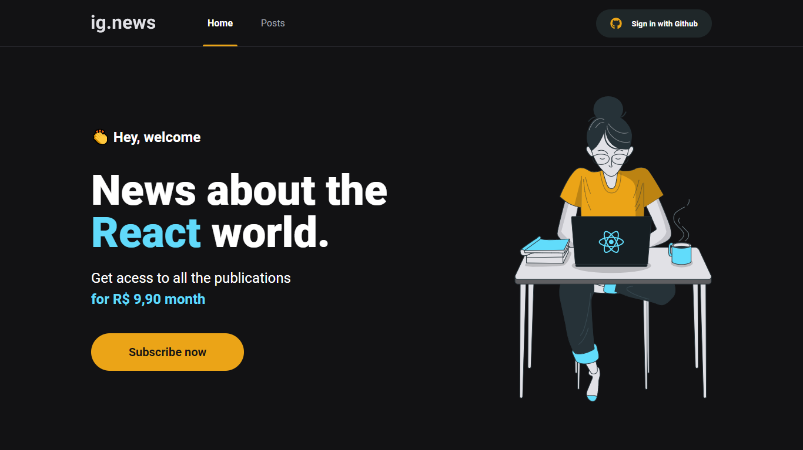

<!-- PROJECT LOGO -->
<br />
<p align="center">
	
  <h1 align="center">Ig News</h1>

  <p align="center">
    Ig News é uma aplicação web, especificamente um blog, com assinatura de produto e visualização de posts
    <br />
    <a href="https://github.com/GilbertoASJ/Ig-news"><strong>Explore os arquivos »</strong></a>
    <br />
    <br />
    <a href="https://github.com/GilbertoASJ/Ig-news">Ver Demo</a>
    ·
    <a href="https://github.com/GilbertoASJ/Ig-news/issues">Reportar Bug</a>
    ·
    <a href="https://github.com/GilbertoASJ/Ig-news/issues">Implementar Feature</a>
  </p>
</p>


<!-- TABLE OF CONTENTS -->
<details open="open">
  <summary>Lista de conteúdo</summary>
  <ol>
    <li>
      <a href="#Sobre-o-projeto">Sobre o projeto</a>
      <ul>
        <li><a href="#Construido-com">Construido com</a></li>
      </ul>
    </li>
    <li>
      <a href="#Como-usar">Como usar</a>
      <ul>
        <li><a href="#Pré-requisitos">Pré-requisitos</a></li>
        <li><a href="#Instalação">Instalação</a></li>
      </ul>
    </li>
    <li><a href="#Contribuindo">Contribuindo</a></li>
    <li><a href="#Licença">Licença</a></li>
  </ol>
</details>


<!-- ABOUT THE PROJECT -->
## Sobre o projeto

<hr>

<hr>

Ig News é uma aplicação web que tem como objetivo o estudo e desenvolvimento de uma aplicação em ReactJS com NextJS para listagem de posts e sistema de inscrição.

A aplicação foi desenvolvida utilizando o framework NextJS aplicando conceitos como consumo de API externas, API Root, Server Side Rendering (SSR), Static Site Generation (SSG), STRIPE para pagamentos das subscriptions, NextAuth para autenticação com Github, FaunaDB para armazenar as informações do usuário em um banco de dados e Prismic CMS para adição e gerenciamento do conteúdo dos posts.

O projeto foi desenvolvido como pratica das aulas do modulo 03 do [Ignite da Rocketseat](https://rocketseat.com.br/)


### Construido com

As tecnologias usadas nesse projeto foram:
- [ReactJS](https://reactjs.org/)
- [NextJS](https://nextjs.org/)
- [TypeScript](https://www.typescriptlang.org/)
- [SASS](https://sass-lang.com/)
- [Next-Auth](https://next-auth.js.org/)
- [Stripe](https://stripe.com/)
- [FaunaDB](https://fauna.com/)
- [Prismic CMS](https://prismic.io/)


<!-- GETTING STARTED -->
## Como usar

Este é um exemplo de como você pode dar instruções sobre como configurar seu projeto localmente. Para obter uma cópia local instalada e funcionando, siga estas etapas simples de exemplo.

### Pré-requisitos

Antes de começar, você vai precisar ter instalado em sua máquina as seguintes ferramentas: Git, Node.js, StripeCLI e Yarn. 

* npm
  ```sh
  npm install --global yarn
  ```

Criar conta e configurar os serviços externos em: Stripe, FaunaDB, Prismic CMS.

### Instalação

```
# Clone este repositório
$ git clone https://github.com/GilbertoASJ/Ig-news.git

# Acesse a pasta do projeto no seu terminal/cmd
$ cd ignews

# Instale as dependências
$ yarn

# Na raiz do projeto crie uma copia do arquivo .env.local.example
# Altere o nome da copia para .env.local
# Preencha as variáveis ambiente de acordo com as instruções
$ cp .env.local.example .env.local

# Execute stripe listen para ouvir eventos do webhook
$ stripe listen --forward-to localhost:3000/api/webhooks 

# Para iniciar a aplicação
$ yarn dev

# A aplicação será aberta na porta:3000 - acesse http://localhost:3000
```


<!-- CONTRIBUTING -->
## Contribuindo

As contribuições são o que tornam a comunidade de código aberto um lugar incrível para aprender, inspirar e criar. Quaisquer contribuições que você fizer são ** muito apreciadas **.

1. Faça um fork do projeto
2. Crie seu Feature Branch (`git checkout -b feature / AmazingFeature`)
3. Faça commit de suas alterações (`git commit -m 'Add some AmazingFeature'`)
4. Envie para o Branch (`git push origin feature / AmazingFeature`)
5. Abra um pull request


<!-- LICENSE -->
## Licença

Distribuído sob a licença MIT. Veja `LICENSE` para obter mais informações.
